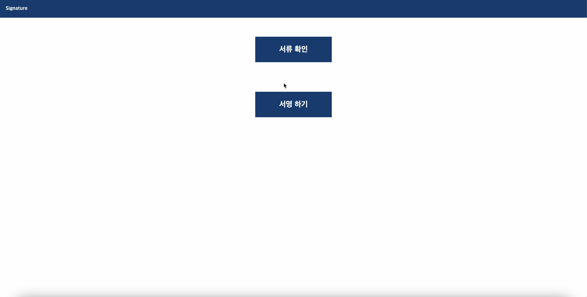
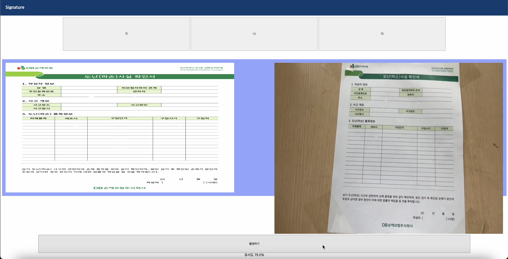
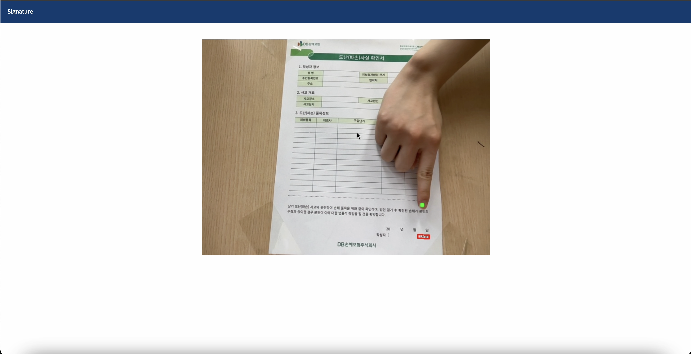
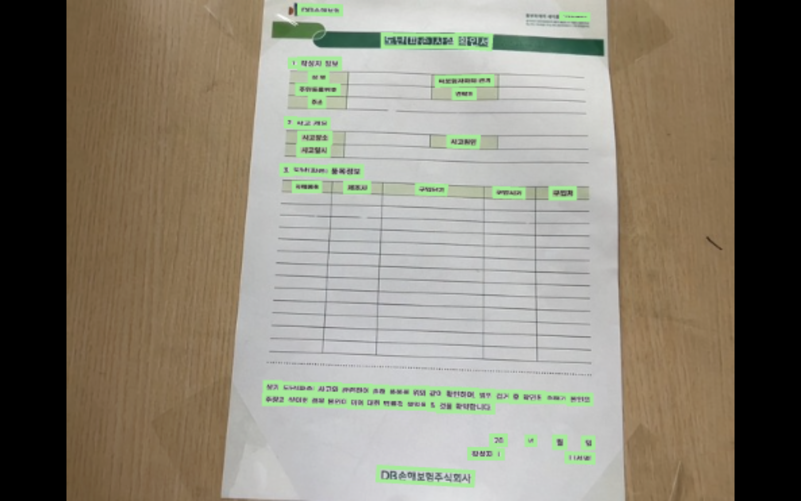

# DAI3004_Project

## Team Members

- 팀장 : 남서용 (컴퓨터학부, 한양대학교 ERICA)
- 팀원 : 김다영 (인공지능학과, 한양대학교 ERICA)
- 팀원 : 김은채 (인공지능학과, 한양대학교 ERICA)
- 팀원 : 임은지 (인공지능학과, 한양대학교 ERICA)

## Introduction

이 프로젝트는 시각장애인 이용자를 위한 이미지 인식을 통해 일상생활의 불편을 덜어주는 것을 목적으로 하여, 서명란의 위치가 어디에 있는지 안내 및 오프라인 종이로 나오는 서류의 내용을 기존에 자신이 서명하려 했던 서류가 맞는지 유사율을 나타낸다.

## Contents

0. [Folder Structure](#folder-structure)
1. [Deelopment Setting](#development-setting)
2. [Libraries & Tools](#libraries--tools)
3. [Pages](#pages)
4. [서류 비교](#signature)
5. [서명 하기](#comparison)
6. [Demo](#demo)

### Folder Structure

```
DAI3004_Project
├── LICENSE
├── README.md
├── app.py
├── cam.py
├── comparison.py
├── ocr.py
├── ocr_capture.py
├── src
├── static
│   ├── favicon.ico
│   ├── file.jpg
│   ├── images
│   │   ├── file_A.png
│   │   ├── file_B.png
│   │   └── file_C.png
│   ├── script.js
│   ├── style.css
│   ├── tts
│   └── uploads
├── templates
│   ├── compare.html
│   ├── index.html
│   └── object.html
├── text
│   ├── A.txt
│   ├── B.txt
│   ├── C.txt
│   ├── boundingbox.txt
│   ├── click.txt
│   ├── output.txt
│   └── result.txt
├── tmp.md
└── tts
```

### Development Setting

- Ubuntu 20.04
- Python 3.8
- etc...

### Libraries & Tools

- easyocr
- Flask
- matplotlib
- mediapipe
- numpy
- opencv-python
- Pillow
- pygame
- PyYAML
- requests
- scipy
- sounddevice
- etc...

### Pages

메인 화면 <br>


서류 확인 <br>


서명 하기 <br>


### Comparison

서류를 미리 전달받으면 DB에 저장하고, 이를 OCR을 진행한다. 이후, 사용자가 은행이나 시청 등의 기관에 가서 받은 서류를 촬영한 뒤 유사율을 확인해본다. 모든 과정은 TTS로 도움을 받을 수 있다. <br>
OCR 한 후의 서류의 모습 <br>


### Signature

### Demo

1. requirements를 설치한다.

```
pip install -r requirements.txt
```

2. 메인 디렉토리 내의 app.py를 실행한다.

```
python app.py
```

3. 본인이 설정한 포트로 접속한다. Ex) 'http://127.0.0.1:443'
